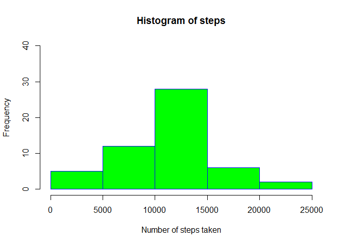
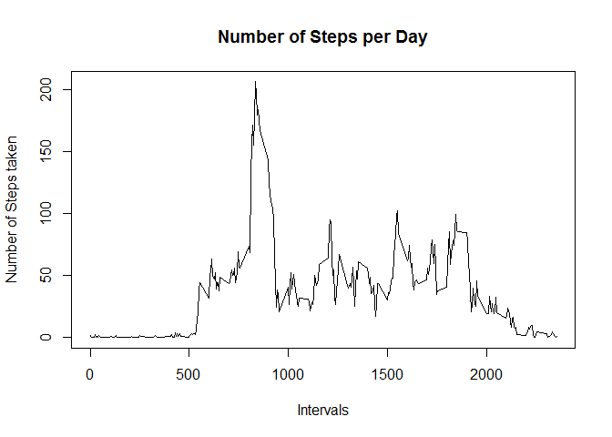
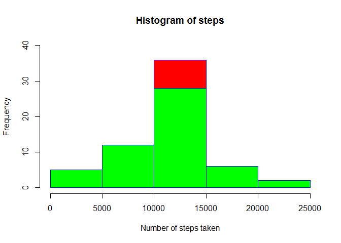

# Reproducible Research: Peer Assessment 1
Giridhar  

## Making all echo to TRUE


## Loading and preprocessing the data

```r
data_new <- read.csv(file = "activity.csv")
```
We need to preprocess the date field as it is of class factor Preprocessing goes like below

```r
data_new$date <- as.character(data_new$date)
data_new$date <- as.Date(data_new$date)
```


## What is mean total number of steps taken per day?


```r
data_1 <- data_new[complete.cases(data_new),]
data_2 <- split(data_1$steps,data_1$date)
data_3 <- sapply(data_2,sum)
hist(data_3, xlab="Number of steps taken", ylab="Frequency", main="Histogram of steps", border="blue", col="green", ylim=c(0,40))
```

<!-- -->

```r
mean_1 <- mean(data_3)
median_1 <- median(data_3)
```
Thus the calculated mean is 1.0766189\times 10^{4} and the median is 10765


## What is the average daily activity pattern?


```r
steps_per_interval <- aggregate(steps ~ interval, data_new, mean)
plot(steps_per_interval$interval,steps_per_interval$steps, type="l", xlab="Intervals", ylab="Number of Steps taken",main="Number of Steps per Day")
```

<!-- -->

```r
max_interval <- steps_per_interval[which.max(steps_per_interval$steps),1]
```

the maximum steps occured in 835th interval

## Imputing missing values


```r
na_no <- sum(!complete.cases(data_new))
```

There are a total of 2304 NA's in the dataset

We are going to replace NA by the avg of that interval
In order to do that we are going to first take the bad data frame with NA seperately
then iterate each element and replace with interval avg


```r
bad_data <- data_new[!complete.cases(data_new),]
for(i in steps_per_interval$interval)
{
    bad_data[bad_data$interval == i,]$steps <- steps_per_interval[steps_per_interval$interval == i,2]
}
```

Now we can combne the pure data with the correcter NA substituted data


```r
good_data <- data_new[complete.cases(data_new),]
corr_data <- rbind(good_data,bad_data)
corrected_data <- corr_data[ order(as.numeric(row.names(corr_data))), ]
```

Now drawing the differnce plot

```r
new_graph <- aggregate(steps ~ date, corrected_data, sum)

hist(new_graph$steps,xlab="Number of steps taken", ylab="Frequency", main="Histogram of steps", border="blue", col="red", ylim=c(0,40))

hist(data_3, xlab="Number of steps taken", ylab="Frequency", main="Histogram of steps", border="blue", col="green", ylim=c(0,40),add = T)
```

<!-- -->

```r
mean_2 <- mean(new_graph$steps)
median_2 <- median(new_graph$steps)

diff1 <- mean_2 - mean_1
diff2 <- median_2 - median_1
```

The new mean and median are
* mean is 1.0766189\times 10^{4}
* median is 1.0766189\times 10^{4}

The difference in mean and median are
* mean difference 0
* median difference 1.1886792

Thus we find that there is a difference in the median value as a result of imputing the data

As an impact of imputing the previous number of steps was 570608 and now the number of steps is raised to 6.5673751\times 10^{5}

giving a difference of 8.6129509\times 10^{4} steps


## Are there differences in activity patterns between weekdays and weekends?


```r
corrected_data$dayofweek = "new"

for(i in 1:nrow(corrected_data))
{
    if(weekdays(corrected_data[i,]$date) == "Monday" ||
       weekdays(corrected_data[i,]$date) == "Tuesday" || 
       weekdays(corrected_data[i,]$date) == "Wednesday"|| 
       weekdays(corrected_data[i,]$date) == "Thursday"||
       weekdays(corrected_data[i,]$date) == "Friday")
    {
        corrected_data[i,]$dayofweek <- "Weekday"
    }
    
    else
    {
        corrected_data[i,]$dayofweek <- "Weekend"
    }
}

corrected_data$dayofweek = as.factor(corrected_data$dayofweek)

corr_steps_intr <- aggregate(steps ~ interval + dayofweek, corrected_data, mean)

library(lattice)

xyplot(corr_steps_intr$steps ~ corr_steps_intr$interval|corr_steps_intr$dayofweek, main="Average Steps per Day by Interval",xlab="Interval", ylab="Steps",layout=c(1,2), type="l")
```

<!-- -->
